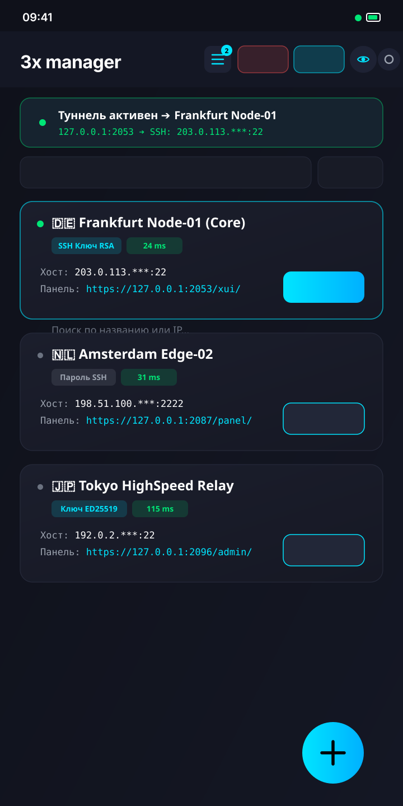
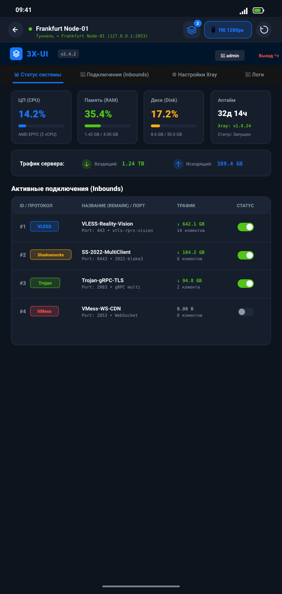
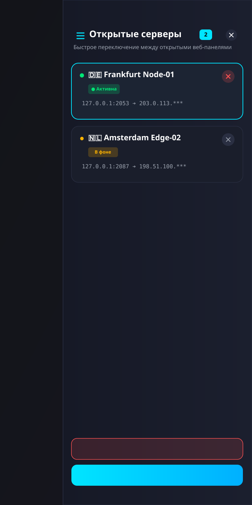
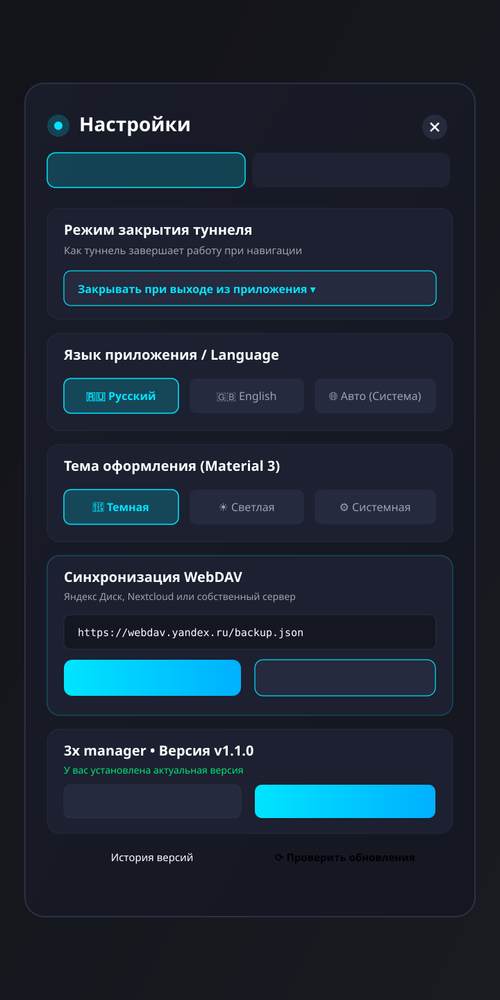

# 3x manager 🚀

<div align="center">

[](#-english)
[](#-russian)
[-green.svg)](https://developer.android.com)
[](LICENSE)
[-purple.svg)](https://developer.android.com/jetpack/compose)

**Modern, ultra-fast, and secure Android client for managing 3x-ui (Xray/V2Ray) panels with built-in automated SSH tunneling.**

[English](#-english) • [Русский](#-russian)

</div>

---

<a name="english"></a>
## 🇬🇧 English

### Overview
**3x manager** is an open-source Android application designed for system administrators and power users managing **3x-ui** (X-UI / Xray / V2Ray) VPN panels. 

It is tailored for hardened server setups where the 3x-ui web panel is bound strictly to `127.0.0.1` (localhost) and hidden behind SSH for maximum security. **3x manager** automatically establishes encrypted SSH port forwarding tunnels, connects to the web panel through an optimized embedded browser, and performs seamless one-click automated authentication.

---

### 📱 Application Screenshots & Capabilities

<div align="center">

| 1. Main Server List & Termius Cards | 2. 3x-ui Web Panel & Dual View |
|:---:|:---:|
| <a href="docs/screenshots/screen_main.svg"></a> | <a href="docs/screenshots/screen_webpanel.svg"></a> |
| **Server Overview & Fast Access**<br>• Termius-style cards with direct **Open** action<br>• 1-Tap IP masking (`203.0.113.***`) for privacy<br>• Tunnel status indicator & disconnect button<br>• Active tabs counter on the top bar | **Embedded 3x-ui Configurator**<br>• Full Desktop 1280px layout with sidebar & charts<br>• Instant switch to adaptive Mobile mode<br>• Automatic credential injection & login<br>• Real-time SSH tunnel status indicator |

| 3. Slide-Out Server Tabs Drawer | 4. Settings, Backup & Themes |
|:---:|:---:|
| <a href="docs/screenshots/screen_tabs_drawer.svg"></a> | <a href="docs/screenshots/screen_settings.svg"></a> |
| **Multi-Server Tab Switching**<br>• Slide-out drawer on right edge on any screen<br>• Active server highlight with status dots<br>• Quick individual tab close button (`✕`)<br>• One-click **Close All** and Home shortcuts | **Settings & Cloud Sync**<br>• Language switcher (**Auto / RU / EN**)<br>• Material 3 Themes (**Dark, Light, System**)<br>• WebDAV Cloud (Nextcloud/Yandex Disk) & JSON<br>• In-App GitHub Releases Auto-Updater |

</div>

---

### ✨ Key Features

#### 🛡️ Automated SSH Tunneling & Port Forwarding
- **Localhost Panel Access**: Connect to panels bound to `127.0.0.1` without exposing panel ports to the public Internet.
- **SSH Key & Password Authentication**: Full support for OpenSSH RSA, ECDSA, ED25519 private keys (with or without passphrases) as well as password authentication.
- **Intelligent Tunnel Lifecycles**:
  - *Close on panel exit*: Disconnects as soon as you return to the server list.
  - *Close on app exit*: Keeps the tunnel alive while navigating between panels and closes on app dismiss.
  - *Keep in background*: Runs a continuous background tunnel until manually disconnected.
- **Android Foreground Service**: Prevents system termination and maintains stable connection state.

#### 📑 Multi-Tab Slide-Out Navigation Drawer (Right Side)
- **Dynamic Tab Counter**: Appears automatically whenever at least one server is open.
- **Seamless Switching**: Switch between multiple open server dashboards on the fly without exiting to the main menu.
- **Tab Management**: Close individual server sessions or close all active tabs in 1 tap.

#### 🌐 Built-in 3x-ui Web Client
- **One-Click Auto-Login**: Automatically fills credentials and signs into the 3x-ui dashboard.
- **Desktop (1280px) & Mobile Modes**: Switch instantly between full desktop PC layout (with side navigation, charts, and table views) and mobile layout for all servers.
- **Optimized WebView Engine**: Fast page load times, session cookie persistence, and smooth gesture navigation.

#### 👁️ Privacy & IP Masking
- **One-Tap IP Concealment**: Instantly mask server IPs (e.g., `194.87.***.***`) in the top app bar to safely share screenshots or use in public.
- **Zero-Distraction UI**: No intrusive toast popups when toggling privacy mode.

#### ☁️ Backup & Cloud Sync
- **WebDAV Cloud Backup**: Sync server configurations with Nextcloud, ownCloud, Yandex Disk, or personal WebDAV servers.
- **Local JSON Export/Import**: Backup and restore configuration files locally or share via Android system share sheet.

#### ⚡ High Performance & Ergonomics
- **60 / 120 FPS Fluid Scrolling**: Optimized Jetpack Compose lazy lists with zero layout lag and fast rendering.
- **Multi-language Support**: Full English and Russian interface with auto system locale detection and in-app switcher.
- **Material Design 3**: Dynamic themes (Dark, Light, System) with smooth transitions.

#### 🔄 Auto-Updater
- **In-App GitHub Releases Updates**: Check for new releases directly within the app and install updates with 1 tap.

---

### 🛠️ Tech Stack
- **Language**: Kotlin 2.0+
- **UI Framework**: Jetpack Compose & Material 3
- **Architecture**: MVVM + Clean Architecture, Coroutines & StateFlow
- **Database**: Room (SQLite) with KSP
- **SSH Engine**: JSch (Java Secure Channel) + Java NIO TCP Forwarder
- **Networking**: Android WebView, CookieManager, OkHttp 4 (WebDAV client)

---

### 🚀 Building from Source

#### Prerequisites
- Android Studio Ladybug / Meerkat (or newer)
- JDK 17 or JDK 21
- Android SDK 36 (Min SDK 24 — Android 7.0+)

#### Build Commands
```bash
# Clone the repository
git clone https://github.com/vegych/3x-ui-manager.git
cd 3x-ui-manager

# Build Release APK
./gradlew assembleRelease

# Run Unit Tests
./gradlew testDebugUnitTest
```
The resulting APK will be generated at:
`app/build/outputs/apk/release/app-release.apk`

---

<a name="russian"></a>
## 🇷🇺 Русский

### Описание
**3x manager** — современное, сверхбыстрое и безопасное Android-приложение для управления серверами и веб-панелями **3x-ui** (X-UI / Xray / V2Ray) с встроенным автоматическим SSH-туннелированием.

Разработано специально для конфигураций с повышенными требованиями к безопасности, когда панель 3x-ui привязана исключительно к `127.0.0.1` (localhost) на удаленном сервере и закрыта от внешней сети. Приложение автоматически поднимает защищенный SSH-туннель (проброс портов), открывает панель во встроенном оптимизированном браузере и автоматически авторизуется в ней.

---

### 📱 Скриншоты и возможности приложения

<div align="center">

| 1. Главный экран и карточки серверов | 2. Веб-панель 3x-ui (Режимы ПК и Мобильный) |
|:---:|:---:|
| <a href="docs/screenshots/screen_main.svg"></a> | <a href="docs/screenshots/screen_webpanel.svg"></a> |
| **Список серверов и быстрый доступ**<br>• Компактные карточки Termius с кнопкой **«Открыть»**<br>• Скрытие IP-адресов в 1 клик (`203.0.113.***`)<br>• Статус туннеля и быстрая кнопка отключения<br>• Счетчик открытых вкладок в шапке | **Встроенный конфигуратор 3x-ui**<br>• Полноэкранный режим ПК (1280px) с сайдбаром и графиками<br>• Мгновенное переключение в адаптивный мобильный режим<br>• Автоматическая авторизация (логин и пароль)<br>• Индикатор статуса SSH-туннеля в реальном времени |

| 3. Выезжающее меню открытых вкладок | 4. Настройки, облачный бэкап и темы |
|:---:|:---:|
| <a href="docs/screenshots/screen_tabs_drawer.svg"></a> | <a href="docs/screenshots/screen_settings.svg"></a> |
| **Быстрое переключение между серверами**<br>• Выезжающая справа панель на любом экране<br>• Подсветка активного сервера и статусные точки<br>• Удобное закрытие конкретной вкладки (`✕`)<br>• Кнопка **«Закрыть все»** и возврат в главное меню | **Настройки и Синхронизация**<br>• Переключение языка (**Auto / RU / EN**)<br>• Темы оформления (**Темная, Светлая, Системная**)<br>• Облако WebDAV (Nextcloud, Яндекс Диск) и JSON<br>• Встроенная проверка обновлений с GitHub |

</div>

---

### ✨ Ключевые возможности

#### 🛡️ Безопасность и SSH-туннелирование
- **Доступ к локальным панелям (127.0.0.1)**: Подключение к панелям без необходимости открывать порт панели в глобальный интернет.
- **Поддержка ключей и паролей**: Аутентификация по SSH Private Key (RSA, ECDSA, ED25519 с поддержкой passphrase) и паролю.
- **Интеллектуальное управление туннелем**:
  - *Закрывать при выходе из панели* — туннель выключается при возврате к списку серверов.
  - *Закрывать при выходе из приложения* — туннель не обрывается при переходе между панелями.
  - *Держать в фоне* — туннель работает постоянно до ручного отключения.
- **Foreground Service**: Стабильная работа SSH-туннеля в фоне без выгрузки системой Android.

#### 📑 Вкладки открытых серверов (Боковое меню)
- **Счетчик открытых серверов**: Автоматически появляется в шапке при открытии хотя бы одного сервера.
- **Быстрое переключение**: Удобный переход между открытыми панелями 3x-ui без необходимости возвращаться в общий список серверов.
- **Управление сессиями**: Закрытие выбранных вкладок или завершение всех сессий в один клик.

#### 🌐 Встроенный веб-клиент 3x-ui
- **Авторизация в один клик (Auto-login)**: Автоматическая подстановка логина и пароля в форму входа 3x-ui.
- **Режимы ПК (1280px) и Мобильный**:
  - Полноэкранный режим ПК (1280px) с развернутым левым сайдбаром, верхним меню и графиками нагрузки.
  - Адаптивный мобильный режим для небольших экранов.
  - Доступно для всех серверов (как с туннелем, так и при прямом подключении).
- **Умная навигация**: Поддержка системных жестов «Назад», быстрое обновление страницы и безопасное управление сессионными Cookie.

#### 👁️ Приватность (Скрытие IP)
- Быстрое скрытие IP-адресов серверов в 1 клик через иконку в шапке приложения (например, `194.87.***.***` для защиты от посторонних глаз и скриншотов).
- Бесшумное переключение без всплывающих уведомлений.

#### ☁️ Резервное копирование и синхронизация
- **Облако WebDAV**: Поддержка Яндекс Диска, Nextcloud, ownCloud или персональных серверов.
- **Локальный файл JSON**: Экспорт и импорт бэкапов в память устройства или через системное меню «Поделиться».

#### ⚡ Высокая производительность и дизайн
- **Плавный скролл 60 / 120 FPS**: Оптимизированный рендеринг списков Jetpack Compose без задержек.
- **Мультиязычность**: Полная поддержка русского и английского языков с возможностью выбора в настройках.
- **Material Design 3**: Поддержка тем (Темная, Светлая, Системная).

#### 🔄 Автообновление
- Проверка новых релизов с GitHub Releases прямо в приложении и установка в 1 клик.

---

### 🛠️ Стек технологий
- **Язык**: Kotlin 2.0+
- **UI**: Jetpack Compose, Material 3
- **Архитектура**: MVVM, Clean Architecture, StateFlow, Coroutines
- **База данных**: Room (SQLite) + KSP
- **SSH Туннель**: JSch (Java Secure Channel) + Java NIO TCP Forwarder
- **Сеть / Web**: Android WebView, CookieManager, OkHttp 4 (WebDAV)

---

### 🚀 Сборка проекта

#### Требования
- Android Studio Ladybug / Meerkat или новее
- JDK 17 или JDK 21
- Android SDK 36 (Min SDK 24 — Android 7.0+)

#### Команды Gradle
```bash
# Клонировать репозиторий
git clone https://github.com/vegych/3x-ui-manager.git
cd 3x-ui-manager

# Сборка релизного APK
./gradlew assembleRelease

# Запуск тестов
./gradlew testDebugUnitTest
```

---

## 📄 License / Лицензия
Distributed under the [MIT License](LICENSE). / Распространяется под лицензией [MIT](LICENSE).
